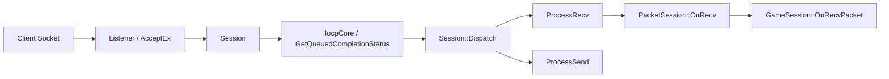

# ServerCore Architecture

## 큰 그림

`ServerCore`는 Windows IOCP 기반 네트워크 프레임워크다. 컨텐츠 레이어는 `Session`을 상속하거나 `PacketSession`을 상속해서 접속, 수신, 송신, 해제 이벤트만 구현하면 된다.



## Session lifecycle

1. `Listener::StartAccept()`가 listen socket을 만들고 IOCP에 등록한다.
2. max session count만큼 `AcceptEvent`를 만들고 `RegisterAccept()`를 호출한다.
3. accept 완료 시 `Listener::ProcessAccept()`에서 peer address를 세팅한다.
4. `session->ProcessConnect()`가 호출된다.
5. `Service::AddSession()`으로 세션 목록에 들어간다.
6. 컨텐츠 hook인 `OnConnected()`가 호출된다.
7. `RegisterRecv()`로 다음 recv를 건다.
8. disconnect 시 `OnDisconnected()` 후 `Service::ReleaseSession()`으로 제거된다.

## IOCP dispatch

`IocpCore::Dispatch(timeoutMs)`는 `GetQueuedCompletionStatus`를 호출하고, 완료된 `IocpEvent`의 owner에게 dispatch한다.

이벤트 타입:

- `Accept`
- `Connect`
- `Disconnect`
- `Recv`
- `Send`

`Session::Dispatch()`는 이벤트 타입에 따라 다음 함수로 보낸다.

- `ProcessConnect()`
- `ProcessDisconnect()`
- `ProcessRecv(numOfBytes)`
- `ProcessSend(numOfBytes)`

## PacketSession

패킷 단위는 고정 헤더 + protobuf payload다.

```cpp
struct PacketHeader
{
    uint16 size;
    uint16 id;
};
```

수신 버퍼 포맷:

```text
[size:2][id:2][payload...][size:2][id:2][payload...]
```

`PacketSession::OnRecv()`는 버퍼 안에 완성된 패킷이 여러 개 있어도 가능한 만큼 처리한다. 헤더가 부족하거나 `header.size`만큼 데이터가 없으면 다음 recv를 기다린다.

## Send path

1. 컨텐츠 코드가 `Session::Send(SendBufferRef)`를 호출한다.
2. `_sendQueue`에 push한다.
3. send가 이미 등록되어 있지 않으면 `_sendRegistered`를 `true`로 바꾸고 `RegisterSend()`를 호출한다.
4. `RegisterSend()`는 큐에 있는 `SendBuffer`들을 `WSABUF` 배열로 묶어 `WSASend`를 건다.
5. 완료 시 `ProcessSend()`가 send buffer 참조를 clear하고, 큐에 남은 데이터가 있으면 다시 `RegisterSend()`한다.

## JobQueue

`JobQueue`는 특정 owner의 작업을 직렬화하기 위한 구조다. `Room`이 이를 상속한다.

핵심 의도:

- 같은 룸의 작업은 한 번에 하나의 실행 흐름에서 처리한다.
- 작업이 몰리면 worker tick 시간 제한 후 `GlobalQueue`로 넘겨 다른 워커가 이어서 처리한다.
- timer job은 `JobTimer`가 tick 기준으로 예약하고, worker loop에서 `DistributeReservedJobs()`가 배포한다.

관련 TLS:

- `LThreadId`: worker thread id.
- `LEndTickCount`: 한 worker loop에서 job을 처리할 시간 상한.
- `LCurrentJobQueue`: 현재 실행 중인 job queue.

## 전역 객체

`CoreGlobal.cpp` 쪽에서 다음 전역 singleton 계열을 초기화한다.

- `GThreadManager`
- `GGlobalQueue`
- `GJobTimer`

`CoreTLS.cpp` 쪽은 thread local 상태를 가진다.

## 수정 시 조심할 점

- `IocpEvent.owner`는 overlapped 작업 중 객체 lifetime을 붙잡는 참조 역할을 한다. 완료/실패 시 적절히 `nullptr`로 풀어준다.
- `Session::RegisterSend()` 내부 lock 처리 주석이 남아 있다. 송신 큐 관련 변경은 race condition을 특히 조심해야 한다.
- `IocpCore::Dispatch()`의 실패 branch에서 `iocpEvent`가 null일 가능성을 고려해야 한다. 현재 코드는 timeout 외 default에서 곧바로 `iocpEvent->owner`를 사용한다.
- `Listener` destructor는 `_acceptEvents`를 delete하지만 TODO가 남아 있다. 실행 중 close와 overlapped accept lifetime은 신중히 다뤄야 한다.

