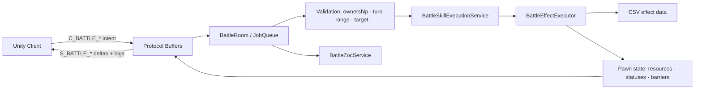

# Project OCH | 개발 포트폴리오용 기술소개서 초안

Updated: 2026-07-29.

## 프로젝트 요약

Project OCH는 Unity 클라이언트와 연동되는 **Windows C++ IOCP 기반 서버 권한형 헥사 전술 전투 게임**이다. 전투 결과를 클라이언트가 계산하지 않고, 서버가 행동 검증·상태 변경·전투 로그·delta를 생성한다. 캐릭터 추가가 진행될수록 `BattleRoom`이 비대해지는 문제를 해결하기 위해 캐릭터 상속 구조와 CSV 효과 파이프라인을 함께 설계했다.

현재 서버는 로컬 `127.0.0.1:7777`에서 최대 100 세션 설정으로 동작하는 개발 프로토타입이다. 시작 시 필드 walk map JSON과 전투 CSV를 검증해 로드하고, 다섯 worker thread가 IOCP dispatch와 job queue를 처리한다. 계정 DB, 채팅 콘텐츠, 서비스 종료 처리, 부하 테스트는 아직 제품 범위에 포함하지 않았다.

| 항목 | 내용 |
| --- | --- |
| 언어 / 환경 | C++20, Windows, Visual Studio |
| 네트워크 | IOCP, AcceptEx, WSASend, JobQueue |
| 직렬화 / 프로토콜 | Protocol Buffers, 패킷 코드 자동 생성 |
| 클라이언트 | Unity, Point Top / Odd-R Tilemap |
| 전투 모델 | 서버 권한형 턴제, 축좌표 헥사 그리드 |
| 데이터 | CSV 기반 클래스·스킬·효과·파라미터·맵·ZOC 프로필 |

## 1. 시스템 구조



### 서버 권한 원칙

- 클라이언트는 이동·스킬 의도와 프리뷰만 전송한다.
- 서버는 소유권, 현재 턴, 생존, 지형, 점유, 거리, 대상 타입, 행동 사용 여부를 검증한다.
- 결과는 `S_BATTLE_MOVE`, `S_BATTLE_SKILL`, `S_BATTLE_END_TURN`의 Pawn delta·타일 delta·행동 로그로 전송한다.
- 다중 대상 공격, 반격, ZOC 반응처럼 한 요청에서 여러 Pawn이 변할 수 있으므로 primary target만이 아니라 모든 delta를 동기화한다.

## 2. 핵심 설계 판단

### A. BattleRoom 비대화 방지: 상속 + 데이터 기반 하이브리드

초기에는 캐릭터별 스킬 로직이 `BattleRoom`에 집중될 위험이 있었다. 이를 다음 경계로 분리했다.

```text
BattlePawn
├─ Beige
│  ├─ BeigeIce
│  └─ BeigeFire
├─ Suen
│  ├─ SuenAxe
│  └─ SuenParvis
├─ Alen
   └─ AlenSpear
└─ Zillian
   └─ ZillianLongbow
```

- `BattlePawn`: 턴 사용 규칙, 이동 가능 여부, 공용 상태·자원·보호막 보유
- 캐릭터 클래스: 장비 상태, 고유 대상 선택, 고유 활성 조건 등 캐릭터 규칙
- `BattleSkillExecutionService`: 대상/범위 처리, 효과 실행 요청 구성, 결과 수집
- `BattleEffectExecutor`: 피해, 회복, 자원, 상태, 장벽, 타일, 장비, ZOC modifier 같은 재사용 효과 primitive 실행
- CSV: 수치, 사거리, 대상 타입, 지속시간, 효과 순서와 파라미터

이 구조를 통해 “새 캐릭터의 일반적인 피해·상태 부여”는 데이터로 추가하고, 재사용 불가능한 행동 규칙만 클래스에 남겼다.

### B. 데이터 파이프라인과 검증

```text
ClassKey.csv → PawnTemplate.csv
                     ↓
BattleSkill.csv → BattleSkillEffect.csv → BattleSkillEffectParam.csv
```

`BattleTemplateManager`는 시작 시 CSV를 읽고 다음을 검증한다.

- ClassKey와 PawnClass enum의 유효성
- 스킬 slot 중복과 효과 그룹 참조
- 효과 인스턴스/파라미터 참조
- 자원·타일 enum 값
- Unity cell 좌표에서 축좌표로의 맵 변환

밸런스 값은 데이터에 두되, 사기 단계처럼 전 캐릭터가 공유하는 전투 규칙은 `BattleRules.h`에 코드 상수로 유지했다. 어지러움의 스턴 확률은 밸런스 조정이 가능하도록 `BattleConfig.csv`에 두었다.

### C. 헥사 좌표 경계의 명확화

전투 로직은 모두 축좌표 `(q, r)`로 처리하고, Unity Point Top / Odd-R Tilemap 변환만 경계 계층에 둔다.

```text
q = col - ((row - (row & 1)) / 2)
r = row
```

거리, 인접 타일, 범위, 방향, 백어택, ZOC는 축좌표로 계산한다. 이로써 렌더링 좌표계가 바뀌어도 전투 규칙이 흔들리지 않도록 했다.

### C-1. 구현 알고리즘 사례: 육각 공간 판정과 규칙 해석

이 프로젝트는 경로 탐색 중심의 프로젝트는 아니지만, 전술 전투 규칙을 정확하고 결정적으로 해석하기 위한 알고리즘을 구현했다.

| 사례 | 접근 | 적용 기능 |
| --- | --- | --- |
| 육각 거리 계산 | axial `(q, r)`를 cube `(q, r, -q-r)`로 확장하고 `(|dq| + |dr| + |ds|) / 2`를 사용 | 사거리, 인접, 광역 범위 |
| 이동 가능성 검증 | 최대 이동 칸 안에서 6방향 인접 셀을 순회하는 bounded BFS | 장애물·점유 Pawn을 우회할 수 있는 이동 경로 검증 |
| 전방 부채꼴 방향 판정 | 대상 벡터와 6개 육각 방향 벡터의 내적이 최대인 방향을 선택 | ZOC, 전방 범위, 백어택 방향성 |
| 직선 범위 생성 | 현재 거리보다 1 가까워지는 방향을 선택해 시작점에서 바깥쪽으로 확장 | 화염벽 `LINE_3`, 알렌 창 `LINE_2` |
| 우선순위 효과 해석 | 효과 그룹별 최소 우선순위를 먼저 수집하고, `StopOnMatch` 조건에 맞는 효과만 실행 | 냉기/열기 역류처럼 조건이 겹치는 효과의 결정적 처리 |
| 제한 재귀 반격 체인 | 회피 또는 HP 무피해 조건에서만 반격을 재귀 실행하고 깊이를 10으로 제한 | 회피·방어·보호막 기반 근접 경합의 무한 루프 방지 |

특히 ZOC는 별도의 타일 목록을 매 프레임 보관하지 않는다. 각 적 Pawn 후보의 이동 시작 타일에 대해 **O(1) 육각 거리 판정 + 6방향 내적 비교**를 수행하고, 클래스 프로필의 사거리·전방 폭·반응 횟수·트리거를 결합해 기회 공격 여부를 결정한다. 즉 맵 타일 수에 비례하는 탐색 없이, 전투 참여 Pawn 수만큼만 판정한다. 실제 이동 유효성은 별도의 bounded BFS로 확인하므로, 직선 거리만으로는 도달할 수 없는 장애물·점유 상황도 거부한다.

현재는 A*나 다익스트라 같은 경로 탐색을 구현하지 않았다. 향후에는 ZOC 위험도와 지형 비용을 반영한 A* 경로 탐색을 추가해 이동 프리뷰와 AI 의사결정까지 확장할 계획이다.

### D. 반응 전투를 로그 기반으로 동기화

근접 공격은 회피 또는 방어력/보호막으로 HP 피해가 0일 때 반격 체인을 만들 수 있다. 서버는 각 타격을 `BattleActionLog`로 누적해 순서와 결과를 전송한다.

- `is_evaded`, `is_guarded`, `is_counter`, `is_back_attack`
- 공격자/방어자 ID, 슬롯, 피해량, 피해 후 HP·방어력
- 클라이언트는 로그 순서에 따라 스킬 연출을 큐잉하고, 경합 중 입력을 잠근다.

ZOC는 이동에 대한 단발성 기회 공격으로 별도 처리했다. 일반 반격 체인을 재사용하지 않아 이동 하나가 과도한 연쇄 전투로 확장되는 것을 방지했고, 향후 특정 퍽만 예외를 허용할 수 있게 했다.

### E. 캐릭터 확장을 고려한 ZOC 서비스

`BattleZocService`는 `BattleRoom`에서 분리된 공용 서비스다.

- 전방 부채꼴 범위, 사거리, 반응 횟수, 반응 스킬 슬롯, 트리거를 프로필로 관리
- 현재 등록 프로필: Suen Axe는 1칸 / Alen Spear는 2칸
- 적 Pawn의 **이동 시작 위치**가 ZOC 안이면 목적지와 무관하게 기회 공격
- `ALLY_ATTACKED_IN_ZONE` 확장 훅으로 파수꾼 같은 미래 스킬 지원
- Pawn별 사용한 ZOC 반응 횟수를 delta로 전송해 클라이언트 프리뷰와 서버 판정을 맞춤

### F. 공용 자원·상태이상 기반

- `MORALE`: `BaseWill × 10`으로 최대치를 초기화하고 현재/최대 자원을 동기화
- `DIZZY`: 공용 `APPLY_DIZZY` primitive가 적용 즉시 부여자의 BaseFocus와 대상의 BaseWill로 스턴 확률을 판정
- `STUN`: 다음 자기 턴에 이동·일반 스킬·궁극기·보조행동을 서버에서 차단
- 상태는 `remainingOwnerTurns` 기준으로 만료하며, 제어용 내부 상태는 클라이언트에 노출하지 않는다.

알렌 창의 밀쳐내기 충돌 처리는 공용 `ApplyDizzy` 로직을 호출한다. 밀쳐지는 대상과 뒤에서 충돌한 Pawn 각각에 즉시 스턴 판정을 적용하며, 판정 자체는 어떤 캐릭터도 재사용할 수 있는 공용 primitive로 유지했다.

## 3. 네트워크와 동시성

`ServerCore`는 Windows IOCP 기반으로 Accept/Recv/Send/Disconnect 완료 이벤트를 처리한다. `Room`은 `JobQueue`를 상속해 같은 전투방의 상태 변경을 직렬화한다.

이 선택으로 다음 상태를 하나의 순서에서 변경한다.

- 전투 턴 큐와 현재 턴 Pawn
- HP·방어력·보호막·자원·상태이상
- 타일 overlay와 장비 드롭 상태
- 사망, 승패, 패킷 전송 대상

### 필드와 PvP 전환 흐름

- 필드 이동은 JSON walkmap의 행별 walkable range를 읽고, 고정소수점 월드 좌표를 Odd-R 셀로 변환해 검증한다.
- PvP 초대 수락 시 두 플레이어를 필드에서 despawn하고 `BattleRoom`에 넣는다.
- 전투 결과는 양측 확인(`C_BATTLE_RESULT_ACK`) 후 필드에 재입장시킨다.
- 연결 종료와 게임 퇴장 시에는 전투방과 필드방에 각각 비동기 정리 작업을 요청한다.

## 4. Protocol Buffers 자동화

`Enum.proto`, `Struct.proto`, `Protocol.proto`를 단일 원본으로 두고, 서버 빌드 전 단계에서 C++ 및 Unity C# 코드를 생성한다.

최근 확장 예시:

- `BattlePawnRole.SPEAR`
- `BattleResourceType.MORALE`
- `BattlePawnInfo/BattlePawnDelta.is_action_blocked`
- `BattlePawnInfo/BattlePawnDelta.zoc_reactions_used_this_turn`
- `BattlePawnDelta.move_range`, `BattlePawnDelta.axial` (이동 버프·밀쳐내기 결과 동기화)

프로토콜 변경과 클라이언트 생성 코드의 불일치 가능성을 줄이는 흐름이다.

## 5. 검증 방식

- Visual Studio MSBuild로 `GameServer` Debug 빌드 검증
- 전투 로그를 통해 피해, 회피, 반격 순서, 방어력·HP 변화를 확인
- 서버가 모든 전투 행동에서 실패 사유를 반환해 클라이언트 동기화 문제를 추적

마지막 문서화된 검증 기준: `GameServer Debug build — warning 0, error 0` (2026-07-20 구현 현황 기준). 이후 코드 변경은 별도 빌드와 전투 시나리오로 다시 확인해야 한다.

## 6. 현재 범위와 다음 개선

### 완료된 범위

- IOCP 서버와 방 단위 직렬화
- PvE/PvP 전투 입장, 턴, 이동, 스킬, 사망, 결과 처리
- Beige Ice / Beige Fire / Suen Axe / Alen Spear / Zillian Longbow의 전용 Pawn 클래스와 주요 전투 규칙
- Alen Spear의 2칸 직선 대상 영역, 밀쳐내기 효과, ZOC modifier, 사기·이동 버프 데이터
- Zillian Longbow의 피격 Dizzy 반응, 명중 판정형 보조 화살, DOT·정화·자기 희생 효과 데이터
- 공용 효과 실행기, 상태·자원·보호막·타일 시스템
- 근접 반격, Suen Axe·Alen Spear ZOC 프로필, 사기·어지러움 기반
- Zillian Longbow의 7개 데이터 기반 스킬과 전용 피격/명중 판정 규칙

### 다음 개선 항목

- ZOC 위험도와 지형 비용을 반영한 A* 이동 경로 탐색 및 AI 의사결정 확장
- 전투 시뮬레이션/회귀 테스트 추가
- Unity 실기기 전투 프리뷰와 축좌표 변환 검증 자동화
- Prop collision 데이터의 서버 walkability 반영
- 계정/캐릭터 영속화, 종료 처리, 부하·장시간 안정성 검증

## 개발자 자기소개 문장 초안

> 저는 네트워크 기능을 연결하는 데서 끝나지 않고, 기획 규칙이 서버 권한 구조와 데이터 파이프라인 안에서 안전하게 확장되도록 설계하는 게임 서버 개발자입니다. Project OCH에서는 IOCP 기반 서버 위에 헥사 전술 전투를 구현하며, 캐릭터별 상속 구조·CSV 효과 시스템·프로토콜 자동 생성·상태 delta 동기화를 하나의 전투 흐름으로 연결했습니다.
